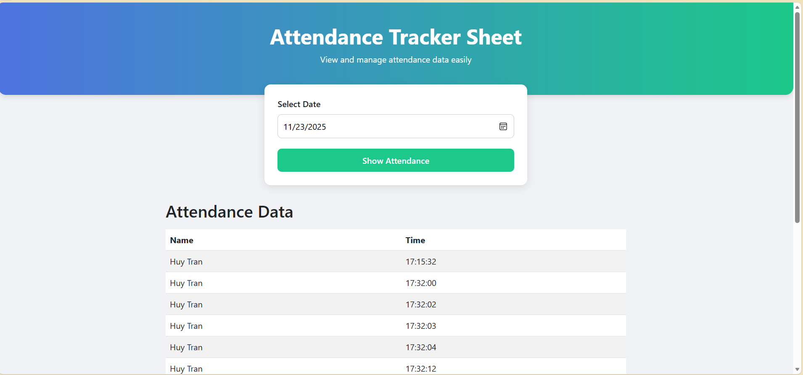

# 📘 Attendance Tracking Web – Face Recognition Entry Log

Ứng dụng web hiển thị danh sách ra/vào theo ngày, lấy dữ liệu từ hệ thống nhận diện khuôn mặt.  
Dự án là một phần của hệ thống chấm công / theo dõi truy cập sử dụng:

- Raspberry Pi / PC  
- Camera nhận diện khuôn mặt  
- Firebase Realtime Database  
- Web Flask để xem lịch sử người ra/vào theo ngày  

---

## 🚀 Tính năng chính
- Giao diện web đẹp, responsive (Bootstrap 5)  
- Tìm kiếm lịch sử theo ngày  
- Hiển thị danh sách:
  - Tên người
  - Thời gian ra/vào  
- Kết nối trực tiếp Firebase Realtime Database  
- Dễ triển khai, code gọn gàng  

---

## 📂 Cấu trúc thư mục
```text
Tracking-Attendance/
│
├── app.py                # Flask Web Server
├── serviceAccountKey.json (KHÔNG push lên GitHub)
├── .gitignore
│
└── templates/
       └── index.html     # Giao diện web
```

---

## 🔧 Yêu cầu hệ thống
- Python 3.8+
- Flask
- firebase-admin
- Truy cập Firebase Realtime Database
- File khóa `serviceAccountKey.json`

---

## 🛠️ Cài đặt & Setup

### 1️⃣ Clone project
```bash
git clone https://github.com/<your_repo>/Tracking-Attendance.git
cd Tracking-Attendance
```

### 2️⃣ Tạo môi trường ảo (khuyến khích)
Windows:
```bash
python -m venv venv
venv\Scripts\activate
```
Linux / macOS:
```bash
python3 -m venv venv
source venv/bin/activate
```
### Cài đặt thư viện
```bash
pip install flask
pip install firebase-admin
```
### 4️⃣ Thêm khóa Firebase (quan trọng)
- Tải file serviceAccountKey.json từ Firebase Console:
Firebase Console → Project Settings → Service accounts → Generate new private key

- Đặt file vào thư mục dự án:
```bash
Tracking-Attendance/
    serviceAccountKey.json
```
⚠️ KHÔNG push file này lên GitHub!
Thêm vào .gitignore:
```
serviceAccountKey.json
*.json
```
### 5️⃣ Chỉnh sửa URL Firebase Realtime Database

Trong app.py, thay URL của bạn:
```
firebase_admin.initialize_app(cred, {
    'databaseURL': 'https://<your-database>.firebaseio.com/'
})
```
### 6️⃣ Chạy server
```
python app.py
```

Mở trình duyệt tại:
```
http://127.0.0.1:5000/
```

---
## 🖥️ Cách hoạt động
Hệ thống nhận diện khuôn mặt ghi log ra Firebase dạng:
```
{
  "attendance": {
    "id1": {
      "name": "Huy Tran",
      "time": "08:35:21",
      "date": "2025-11-24"
    }
  }
}
```
Web Flask truy vấn:
```
attendance_ref.order_by_child('date').equal_to(selected_date).get()
```
Giao diện web hiển thị dữ liệu dưới dạng bảng.

---

## 🖼️ Giao diện minh họa



---

## 🔒 Bảo mật
KHÔNG push serviceAccountKey.json lên GitHub

Sử dụng .gitignore để tránh rò rỉ khóa

Nếu lỡ commit, cần rewrite history và đổi lại khóa Firebase

