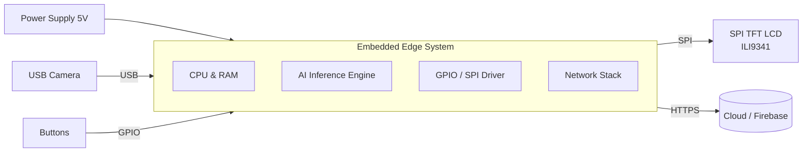
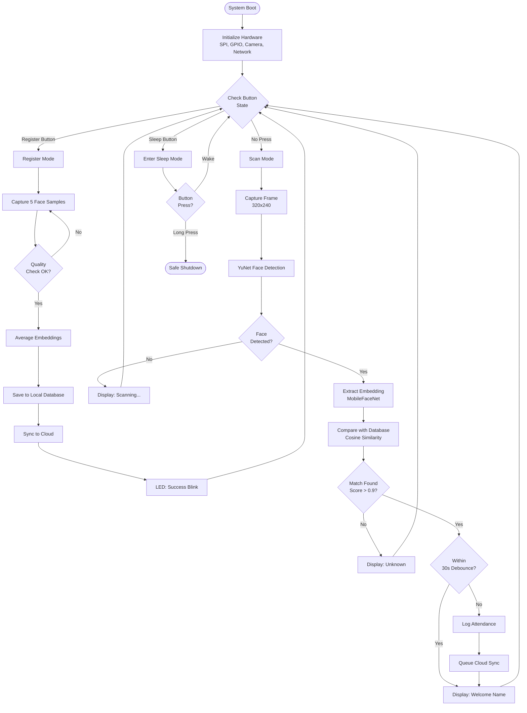
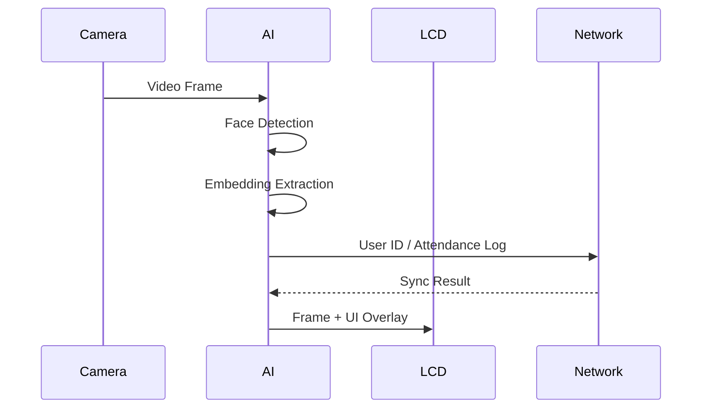

# Face Recognition Access Control
**Raspberry Pi – Embedded Edge AI System**

---

## 1. Overview

This project is a **real-time face recognition access control system** designed to run directly on a **Raspberry Pi** as a **headless embedded edge device**.

The system is optimized for embedded and industrial use cases such as:

- Access control terminals
- Attendance & time-keeping systems
- Kiosk devices
- Smart embedded appliances

**Key design principles:**

- No desktop stack (no X11, Wayland, DRM, or framebuffer)
- Direct hardware access (SPI, GPIO)
- Deterministic multi-threaded execution
- Offline-first with optional cloud synchronization

---

## 2. Hardware Specification

### 2.1 Main Controller

| Item | Specification |
|------|---------------|
| Platform | Raspberry Pi 3B / 3B+ / Raspberry Pi 4 |
| SoC | Broadcom BCM2835 / BCM2837 / BCM2711 |
| CPU | ARMv7 / ARMv8 Cortex-A53/A72 |
| RAM | 1–4 GB (model dependent) |
| Power | 5V DC, 2.5A minimum |

---

### 2.2 Display Module

| Item | Specification |
|------|---------------|
| Type | SPI TFT LCD |
| Controller IC | ILI9341 |
| Resolution | 320 × 240 pixels |
| Color Format | RGB565 (16-bit) |
| Interface | SPI (BCM2835) |
| Driver | Custom low-level SPI driver |
| Framebuffer | ❌ Not used |

---

### 2.3 Camera Module

| Item | Specification |
|------|---------------|
| Type | USB UVC Camera |
| Interface | USB 2.0 |
| Resolution | 320 × 240 |
| Frame Rate | ~30 FPS |
| Driver | UVC (Linux V4L2) |

---

### 2.4 GPIO & User Inputs

| Signal | Description |
|--------|-------------|
| Register Button | User enrollment trigger |
| Sleep Button | Sleep / shutdown control |
| Status LED | System status indication |
| LCD DC | Data / Command control |
| LCD RESET | LCD reset line |

**GPIO Configuration:**
- GPIO library: **BCM2835**
- Internal pull-up resistors enabled
- Polling-based button handling

---

## 3. Software Specification

### 3.1 Operating System

| Item | Value |
|------|-------|
| OS | Raspberry Pi OS / Yocto Linux |
| Mode | Headless |
| Init System | systemd |
| Runtime | Native Linux |

---

### 3.2 Programming Environment

| Item | Value |
|------|-------|
| Language | C++17 |
| Build System | Make |
| Threading | POSIX pthread |
| Networking | libcurl |
| JSON | nlohmann/json |

---

### 3.3 AI & Computer Vision

| Component | Description |
|-----------|-------------|
| Face Detection | YuNet (ONNX) |
| Face Embedding | MobileFaceNet (ONNX) |
| Inference Engine | OpenCV DNN |
| Embedding Size | 128-D float |
| Similarity Metric | Cosine similarity |
| Match Threshold | 0.9 |

---

### 3.4 Functional Modes

#### Register Mode
- Triggered by hardware button
- Captures 5 high-quality face samples
- Averages embeddings
- Stores data locally (encrypted) and on cloud

#### Scan Mode
- Continuous face recognition
- Displays user name and confidence
- Attendance logging
- Per-user debounce: 30 seconds

#### Power Management

| Action | Behavior |
|--------|----------|
| Short press | Enter sleep mode |
| Long press (≥3s) | Safe system shutdown |

---

## 4. System Architecture

### 4.1 Multi-threaded Design

| Thread | Responsibility |
|--------|----------------|
| Camera Thread | Frame capture |
| AI Thread | Detection & recognition |
| LCD Thread | UI rendering & SPI transfer |
| Network Thread | Cloud sync |
| Button Thread | User input handling |

---

## 5. Block Diagram (Datasheet Style)


```mermaid
flowchart LR
    PWR[Power Supply 5V] --> RPI[Raspberry Pi SoC]

    CAM[USB Camera] -->|USB| RPI
    BTN[Buttons] -->|GPIO| RPI

    RPI -->|SPI| LCD[SPI TFT LCD<br/>ILI9341]

    RPI -->|HTTPS| CLOUD[(Cloud / Firebase)]

    subgraph RPI[Embedded Edge System]
        CPU[CPU & RAM]
        AI[AI Inference Engine]
        IO[GPIO / SPI Driver]
        NET[Network Stack]
    end
```

---

## 6. System Flow Chart


```mermaid
flowchart TD
    START([System Boot]) --> INIT[Initialize Hardware<br/>SPI, GPIO, Camera, Network]
    INIT --> CHECK_BTN{Check Button<br/>State}
    
    CHECK_BTN -->|Register Button| REG_MODE[Register Mode]
    CHECK_BTN -->|Sleep Button| SLEEP[Enter Sleep Mode]
    CHECK_BTN -->|No Press| SCAN_MODE[Scan Mode]
    
    REG_MODE --> CAPTURE[Capture 5 Face Samples]
    CAPTURE --> QUALITY{Quality<br/>Check OK?}
    QUALITY -->|No| CAPTURE
    QUALITY -->|Yes| AVG_EMB[Average Embeddings]
    AVG_EMB --> SAVE_LOCAL[Save to Local Database]
    SAVE_LOCAL --> SAVE_CLOUD[Sync to Cloud]
    SAVE_CLOUD --> LED_SUCCESS[LED: Success Blink]
    LED_SUCCESS --> CHECK_BTN
    
    SCAN_MODE --> CAM_CAPTURE[Capture Frame<br/>320x240]
    CAM_CAPTURE --> DETECT[YuNet Face Detection]
    DETECT --> FACE_FOUND{Face<br/>Detected?}
    
    FACE_FOUND -->|No| DISPLAY_SCAN[Display: Scanning...]
    DISPLAY_SCAN --> CHECK_BTN
    
    FACE_FOUND -->|Yes| EXTRACT[Extract Embedding<br/>MobileFaceNet]
    EXTRACT --> COMPARE[Compare with Database<br/>Cosine Similarity]
    COMPARE --> MATCH{Match Found<br/>Score > 0.9?}
    
    MATCH -->|No| DISPLAY_UNK[Display: Unknown]
    DISPLAY_UNK --> CHECK_BTN
    
    MATCH -->|Yes| DEBOUNCE{Within<br/>30s Debounce?}
    DEBOUNCE -->|Yes| DISPLAY_NAME[Display: Welcome Name]
    DEBOUNCE -->|No| LOG_ATT[Log Attendance]
    LOG_ATT --> SYNC_CLOUD[Queue Cloud Sync]
    SYNC_CLOUD --> DISPLAY_NAME
    DISPLAY_NAME --> CHECK_BTN
    
    SLEEP --> SLEEP_WAIT{Button<br/>Press?}
    SLEEP_WAIT -->|Wake| CHECK_BTN
    SLEEP_WAIT -->|Long Press| SHUTDOWN([Safe Shutdown])
```

---

## 7. Data Flow Sequence


```mermaid
sequenceDiagram
    participant Camera
    participant AI
    participant LCD
    participant Network

    Camera->>AI: Video Frame
    AI->>AI: Face Detection
    AI->>AI: Embedding Extraction
    AI->>Network: User ID / Attendance Log
    Network-->>AI: Sync Result
    AI->>LCD: Frame + UI Overlay
```

---

## 7. Storage & Networking

### 7.1 Local Storage

**File:** `userdata.dat`
- **Format:** Binary
- **Encryption:** XOR (`0xAA`)
- **Maximum embedding storage:** 1024 floats

---

### 7.2 Cloud Integration

| Node | Purpose |
|------|---------|
| `/users` | User metadata |
| `/attendance` | Attendance records |

**Network Features:**
- HTTPS communication
- Timeout & retry protection
- Offline-first design

---

## 8. Build & Execution

### 8.1 Dependencies

- OpenCV (with DNN module)
- BCM2835
- libcurl
- pthread

---

### 8.2 Build

```bash
make
```

---

### 8.3 Run

```bash
sudo ./app_camera
```

> **Note:** Root permission is required for SPI and GPIO access.

---

## 9. Deployment Notes

- Headless embedded operation
- systemd service supported
- Compatible with Yocto-based images
- Suitable for industrial deployment

---

## 10. Limitations

- Single camera support
- SPI bandwidth limits LCD refresh rate
- Performance depends on Raspberry Pi model

---

## 11. Authors

- **Le Hong Phong**
- **Tran Gia Huy**

---

## 12. License

**Internal / Embedded Use Only**

Redistribution requires author approval.

---

**Document Version:** 1.0  
**Last Updated:** December 2024
