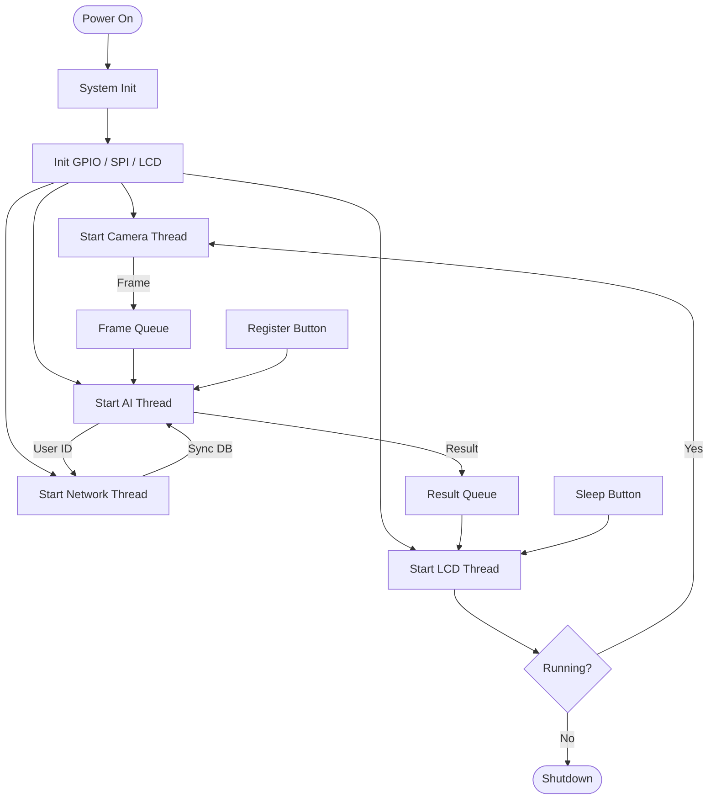
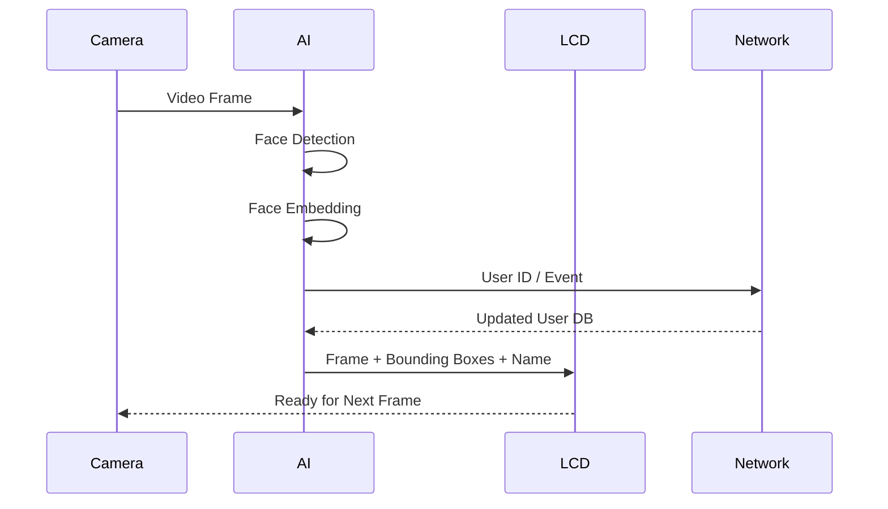

# Face Recognition System (Raspberry Pi)

## 1. Scope

This repository contains an embedded face recognition application intended to run on Raspberry Pi platforms as an **edge device**. The software is designed for direct hardware access and deterministic runtime behavior.

The system is not a desktop application and does not rely on the Linux framebuffer or windowing system.

---

## 2. Target Platform

* SoC: Broadcom BCM2835 / BCM2836 / BCM2711
* Board: Raspberry Pi 3B / 3B+ / Raspberry Pi 4
* OS: Linux (Raspberry Pi OS / Yocto-based rootfs)
* CPU Architecture: ARMv7 / ARMv8

---

## 3. Hardware Interfaces

### 3.1 Display Interface

* Type: SPI TFT LCD
* Controller: ILI9341
* Resolution: 320x240
* Color format: RGB565
* Driver: Custom SPI driver using BCM2835 library

The display is driven directly over SPI. Linux framebuffer and DRM/KMS are not used.

### 3.2 Camera Interface

* Type: USB UVC camera
* Resolution: 320x240 (configurable)
* Capture: OpenCV VideoCapture

### 3.3 GPIO

* Library: BCM2835
* Numbering: Physical pin numbering (RPI_V2_GPIO_P1_xx)
* Inputs:

  * Register button
  * Sleep button
* Internal pull-up resistors enabled in software

---

## 4. System Flow Chart


```mermaid
flowchart TD
    START([Power On]) --> INIT[System Init]
    INIT --> HW[Init GPIO / SPI / LCD]
    HW --> CAM[Start Camera Thread]
    HW --> AI[Start AI Thread]
    HW --> NET[Start Network Thread]
    HW --> LCD[Start LCD Thread]

    CAM -->|Frame| Q1[Frame Queue]
    Q1 --> AI
    AI -->|Result| Q2[Result Queue]
    Q2 --> LCD

    AI -->|User ID| NET
    NET -->|Sync DB| AI

    BTN[Register Button] --> AI
    BTN2[Sleep Button] --> LCD

    LCD --> LOOP{Running?}
    LOOP -->|Yes| CAM
    LOOP -->|No| STOP([Shutdown])
```

---

## 5. Software Architecture

The application is implemented as a multi-threaded process with strict separation of responsibilities.

* Camera thread

  * Captures frames from USB camera
  * Pushes frames into shared queue

* AI thread

  * Performs face detection
  * Runs MobileFaceNet (ONNX) for embedding extraction
  * Computes cosine similarity for identity matching

* LCD thread

  * Converts BGR888 to RGB565
  * Sends frame buffer over SPI to ILI9341

* Network thread

  * Synchronizes user database with Firebase
  * Uploads recognition / attendance events
  * Runs asynchronously to avoid blocking real-time tasks

Thread synchronization is handled using mutexes, condition variables, and bounded queues.

---

## 6. Data Flow Diagram


```mermaid
sequenceDiagram
    participant Camera
    participant AI
    participant LCD
    participant Network

    Camera->>AI: Video Frame
    AI->>AI: Face Detection
    AI->>AI: Face Embedding
    AI->>Network: User ID / Event
    Network-->>AI: Updated User DB
    AI->>LCD: Frame + Bounding Boxes + Name
    LCD-->>Camera: Ready for Next Frame
```

---

## 7. AI Model

* Model: MobileFaceNet
* Format: ONNX
* Inference backend: OpenCV DNN
* Output: 128-D face embedding vector

---

## 8. Thread Interaction Diagram

```
+-------------+      +-------------+      +-------------+
| Camera      | ---> | AI Thread   | ---> | LCD Thread  |
+-------------+      +-------------+      +-------------+
       |                    |
       |                    v
       |             +-------------+
       |             | Network     |
       |             | Thread      |
       |             +-------------+
       |
       v
+-------------+
| Button ISR  |
+-------------+
```

---

## 9. Build System

* Build type: Native build
* Language: C++17
* Build tool: Make

### 6.1 Dependencies

* OpenCV (C++ development headers)
* BCM2835 library
* libcurl (network communication)

### 6.2 Build

```bash
make
```

---

## 7. Runtime

The application requires root privileges for direct SPI and GPIO access.

```bash
sudo ./app_camera
```

---

## 8. Deployment Notes

* Suitable for headless operation
* Intended for kiosk or dedicated appliance usage
* Can be integrated into system startup via systemd service
* Compatible with Yocto-based images if BCM2835 and OpenCV are included

---

## 9. Limitations

* Single-camera support
* SPI bandwidth limits LCD refresh rate
* Performance depends on Raspberry Pi model

---

## 10. Author

* Le Hong Phong
* Tran Gia Huy
---

## 11. License

Internal / embedded use only. Redistribution requires author approval.
